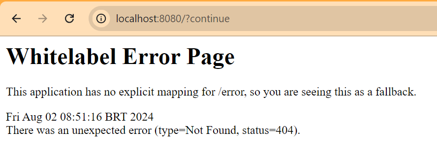

# README

## Adding security to a REST API with Spring Security

Barebone project with spring boot web and spring security.

# Start the application

```bash
mvnw spring-boot:run
```

Access the local server at  [http://localhost:8080]().

The credentials defined at `application.properties` are no longer used.

```bash
#spring.security.user.name=john
#spring.security.user.password=user123
#pring.security.user.roles=USERS
```
The credentials is now defined at the `SecurityConfiguration` class with
two users.

```java
public InMemoryUserDetailsManager userDetailsService() {
        UserDetails user = User.builder()
        .username("john")
        .password("{noop}user321")
        .roles("USERS")
        .build();

        UserDetails manager = User.builder()
        .username("manager")
        .password("{noop}manager321")
        .roles("MANAGERS")
        .build();

        return new InMemoryUserDetailsManager(user, manager);
    }
```

Still, after logging in, just a Whitelabel Error Page would be shown because there's nothing created in the application yet.



----
## Next - Simple Authorization

Change to the `step03` branch to setup simple authorization.

```bash
git checkout step03
```